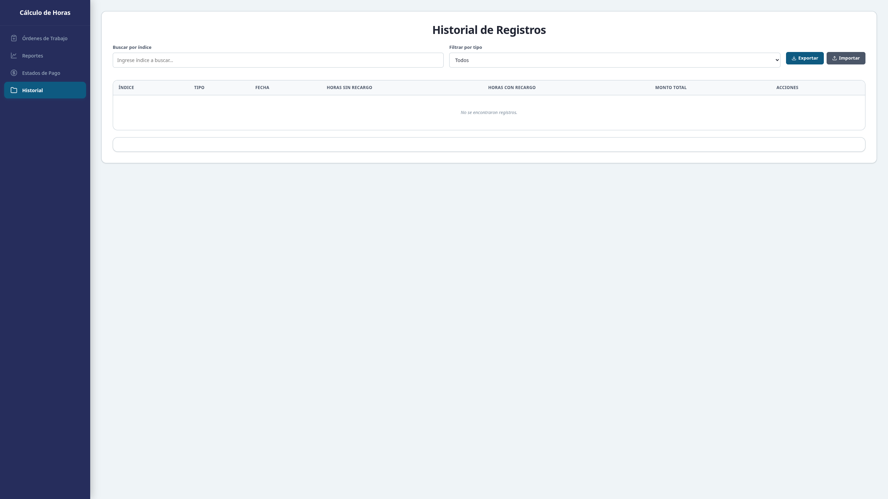

# ⏱️ Cálculo de Horas

Herramienta web para calcular los costos del servicio de una organización, basada en las horas trabajadas por el personal, considerando distintos tipos de jornada y reglas de recargo.

## 🧠 Problema que Resuelve

En muchas organizaciones, el cálculo de costos de servicios requiere considerar:

- **Días normales, sábados, domingos y festivos**, cada uno con reglas distintas de recargo.
- **Horas sin recargo y con recargo** (con porcentaje de recargo configurable: 0%, 10%, 20%, 30%).
- **Horas dobles del operador**, que aplican en horarios específicos (antes de las 07:00, después de las 19:00, o todo el día según el tipo de jornada).
- **Descuentos por colación**, que pueden aplicarse a horas con o sin recargo según se requiera.
- **Jornadas que cruzan la medianoche**, donde el cálculo debe considerar correctamente el paso de un día a otro.
- **Mínimo de horas garantizado**, que asegura un piso mínimo de horas facturables.
- **Reportes semanales** que consolidan los 7 días de la semana en un solo cálculo con totales generales.
- **Almacenamiento persistente** de cálculos para consulta y reutilización posterior.

Esta herramienta automatiza todos estos cálculos, evitando errores manuales y entregando resultados precisos al instante.

## 🚀 Funcionalidades

### 📋 Calculadora Individual (Órdenes de Trabajo)
- Selección del tipo de día: Normal, Sábado, o Domingo/Festivo.
- Ingreso de hora de inicio y término (con soporte para jornadas que cruzan medianoche).
- Valor hora seleccionable entre valores predefinidos o personalizado.
- Porcentaje de recargo configurable (0%, 10%, 20%, 30%).
- Mínimo de horas garantizado (0, 5, 6, 8 o 9 horas).
- Descuento opcional de tiempo de colación (15, 30, 45 o 60 minutos), aplicable a horas sin recargo o con recargo.
- Cálculo detallado de:
  - Horas sin recargo del servicio.
  - Horas con recargo del servicio (valor hora × multiplicador de recargo).
  - Horas normales del operador.
  - Horas dobles del operador.
  - Monto total del servicio.
- **Almacenamiento**: Guardar resultados con un índice personalizado.

### 📊 Reporte Semanal
- Ingreso de jornada para cada día de la semana (lunes a domingo).
- Cada día se categoriza automáticamente según su tipo (Normal, Sábado, Domingo/Festivo).
- Valor hora global para toda la semana.
- Mínimo de horas y porcentaje de recargo globales.
- Cálculo consolidado con totales semanales.
- **Almacenamiento**: Guardar reportes completos con un índice personalizado.

### 📁 Historial de Registros
- Tabla con todos los registros almacenados (órdenes y reportes).
- **Filtros**: búsqueda por índice y filtro por tipo (Orden/Reporte).
- **Acciones por registro**:
  - 👁️ **Ver**: Muestra detalle completo del registro (fecha, horas, montos, días del reporte).
  - ✏️ **Modificar**: Redirige a la página de Órdenes o Reportes con los datos cargados para editar.
  - 🗑️ **Eliminar**: Elimina el registro tras confirmación.
- **Exportar JSON**: Descarga todos los registros en formato JSON para usar en otros sistemas.
- **Importar JSON**: Carga registros desde un archivo JSON, fusionando con los existentes (actualiza si el índice ya existe, agrega si es nuevo).

## 🛠️ Tecnologías Utilizadas

| Tecnología                    | Descripción                                                                                     |
| ----------------------------- | ----------------------------------------------------------------------------------------------- |
| **HTML5**                     | Estructura de la aplicación (4 páginas: inicio, órdenes, reportes, historial)                   |
| **CSS3**                      | Estilos con arquitectura modular: variables, reset, tipografía, layouts, componentes y páginas  |
| **JavaScript (ES Modules)**   | Lógica de cálculo, manipulación del DOM, manejo de eventos, almacenamiento local y validaciones |
| **Vite**                      | Bundler para desarrollo y build de producción                                                   |
| **localStorage**              | Persistencia de datos en el navegador                                                           |
| **Sin dependencias externas** | Proyecto 100% autónomo, no requiere frameworks ni librerías adicionales                         |

### Estructura del Proyecto

```
📁 CalculoHoras/
├── index.html              # Página de inicio / bienvenida
├── ordenes.html            # Calculadora de horas y costos
├── reportes.html           # Reporte semanal
├── historial.html          # Historial de registros almacenados
├── package.json            # Configuración del proyecto y dependencias
├── vite.config.js          # Configuración de Vite (multi-page build)
├── src/
│   ├── index.js            # Entry point de inicio
│   ├── ordenes.js          # Entry point de órdenes
│   ├── reportes.js         # Entry point de reportes
│   ├── historial.js        # Entry point de historial
│   ├── core/
│   │   ├── constants.js    # Constantes de dominio (rangos, multiplicadores, tipos de día)
│   │   ├── entities/
│   │   │   └── workDay.js  # Entidad WorkDay
│   │   ├── use-cases/
│   │   │   ├── calculateDay.js        # Cálculo completo de una jornada
│   │   │   ├── calculateService.js    # Cálculo de horas de servicio
│   │   │   └── calculateOperator.js   # Cálculo de horas del operador
│   │   └── utils/
│   │       ├── dateUtils.js   # Utilidades de fecha
│   │       ├── formatUtils.js # Formateo de moneda y horas
│   │       └── timeUtils.js   # Cálculos con rangos horarios
│   ├── store/
│   │   ├── store.js           # Estado global (Patrón Observer)
│   │   ├── actions/
│   │   │   └── calculatorActions.js  # Acciones de cálculo
│   │   └── storageManager.js  # Gestor de localStorage (CRUD + export/import JSON)
│   └── ui/
│       ├── components/
│       │   └── sidebar.js     # Componente de navegación lateral
│       ├── pages/
│       │   ├── ordenes.js     # Lógica de la página de órdenes
│       │   ├── reportes.js    # Lógica de la página de reportes
│       │   └── historial.js   # Lógica de la página de historial
│       └── render/
│           ├── renderResults.js  # Renderizado de resultados individuales
│           └── renderReport.js   # Renderizado de reportes semanales
├── css/
│   ├── main.css             # Punto de entrada de estilos (importa todos los módulos)
│   ├── base/
│   │   ├── variables.css    # Variables CSS (colores, sombras, tipografía)
│   │   ├── reset.css        # Reset de estilos
│   │   └── typography.css   # Estilos tipográficos base
│   ├── layouts/
│   │   └── layout.css       # Estructura de layout principal (sidebar + contenido)
│   ├── components/
│   │   ├── sidebar.css      # Estilos del menú lateral
│   │   ├── container.css    # Estilos del contenedor de contenido
│   │   ├── form.css         # Estilos de formularios e inputs
│   │   ├── button.css       # Estilos de botones
│   │   ├── info-box.css     # Cajas de información
│   │   ├── error.css        # Mensajes de error
│   │   ├── results.css      # Resultados de cálculo
│   │   ├── welcome-card.css # Tarjeta de bienvenida
│   │   ├── report-table.css # Tabla del reporte semanal
│   │   └── historial-table.css # Tabla del historial
│   └── pages/
│       ├── home.css         # Estilos de la página de inicio
│       ├── ordenes.css      # Estilos de la página de órdenes
│       └── reportes.css     # Estilos de la página de reportes
```

## 📖 Reglas de Cálculo

### Servicio

| Tipo        | Rango (día normal)               | Factor                    |
| ----------- | -------------------------------- | ------------------------- |
| Sin recargo | 07:00 – 18:00                    | × 1.0 (valor hora)        |
| Con recargo | 18:00 – 07:00 (cruza medianoche) | × 1.0 + (% recargo / 100) |

### Operador

| Tipo           | Rango (día normal)                   |
| -------------- | ------------------------------------ |
| Horas normales | Total de horas trabajadas            |
| Horas dobles   | Antes de las 07:00 y desde las 19:00 |

### Variaciones según tipo de día

| Día               | Con recargo desde | Dobles desde        |
| ----------------- | ----------------- | ------------------- |
| Normal (lun–vie)  | 18:00             | 19:00 y antes 07:00 |
| Sábado            | 13:00             | 13:00               |
| Domingo / Festivo | Todo el día       | Todo el día         |

## 📸 Capturas de Pantalla

### Pantalla de Inicio

Vista principal con el menú lateral y las opciones de navegación.

### Cálculo de Órdenes

Formulario de cálculo de horas y costos con resultados visibles y opción de guardar.

### Cálculo de reportes

Reporte semanal con varios días ingresados, totales consolidados y opción de guardar.

### Estado de pago

Consolidadción de los reportes u ordenes de trabajo en un estado de pago.

### Historial

Historial con todos los tipos de documentos.

## 🧑‍💻 Aprendizaje

Este proyecto fue desarrollado como práctica de:

- **JavaScript (ES Modules)**: Organización del código en módulos con import/export, separación de responsabilidades (core, store, ui).
- **Arquitectura limpia**: Separación en capas (entidades, casos de uso, utilidades, store, UI) siguiendo principios de diseño.
- **Manipulación del DOM**: Manejo de eventos (`submit`, `change`, `click`), renderizado dinámico de elementos y actualización de la interfaz.
- **Cálculos horarios**: Implementación de lógica precisa para determinar intersecciones entre rangos de tiempo, incluso cuando cruzan la medianoche, utilizando el sistema de minutos desde medianoche.
- **localStorage**: Persistencia de datos en el navegador con operaciones CRUD y serialización/deserialización JSON.
- **Exportación e importación de datos**: Generación y lectura de archivos JSON para interoperabilidad con otros sistemas.
- **Vite**: Configuración de build multi-page para una aplicación con múltiples puntos de entrada HTML.
- **Arquitectura modular de CSS**: Variables CSS, organización en base/componentes/layouts/páginas, imports modulares.

## 🚀 Cómo Usar

### Desarrollo

```bash
# Instalar dependencias
npm install

# Iniciar servidor de desarrollo
npm run dev

# Build de producción
npm run build
```

### Producción

1. Clona o descarga el repositorio.
2. Ejecuta `npm install` para instalar dependencias.
3. Ejecuta `npm run build` para generar la carpeta `dist/`.
4. Abre `dist/index.html` en tu navegador o sirve la carpeta `dist/` con cualquier servidor web.

### Flujo de trabajo

1. Selecciona **Órdenes de Trabajo** para calcular un servicio individual.
2. Ingresa los datos del servicio y presiona **Calcular**.
3. Opcionalmente ingresa un **índice** y presiona **💾 Guardar Registro** para almacenarlo.
4. Selecciona **Reportes** para generar un reporte semanal consolidado.
5. Opcionalmente guarda el reporte con un índice.
6. Selecciona **Historial** para ver, modificar, eliminar o exportar/importar todos los registros.

## 📄 Licencia

Este proyecto es de uso libre.